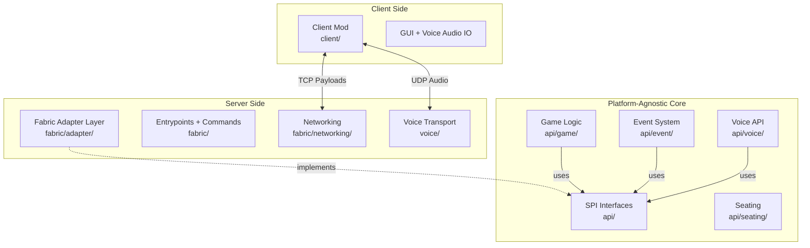

# Architecture Overview

For developers who want to understand the codebase structure, extend the mod, or contribute.

This document explains how the Midnight Council mod is organized and the reasoning behind those choices. It covers the platform-agnostic core, the Fabric adapter layer, the event system, state synchronization, voice, testing, and the build. It is a narrative companion to the [API Reference](api-reference.md), which documents individual types and methods.

## Design Philosophy

The core principle is a **platform-agnostic core with a Fabric adapter layer**.

Every bit of game logic lives in the `api/` package and has zero Minecraft or Fabric dependencies. Nothing in `api/` imports `net.minecraft.*` or `net.fabricmc.*`. Platform-specific code, the parts that actually talk to the Minecraft server, the network stack, and the config files, lives in `fabric/` adapter implementations.

This split pays off in three ways:

- **Testability.** Game logic is pure Java, so it can be unit tested without booting a Minecraft server or mocking platform objects. The 557-test suite runs in seconds with no MC runtime.
- **Portability.** Because the core never touches platform APIs, a future port to another mod loader would mean writing a new set of adapter implementations, not rewriting game logic.
- **Separation of concerns.** Game rules and platform plumbing stay in different files, different packages, and different mental models. Reviewing a vote-tallying algorithm does not require reading Fabric networking boilerplate.

## Layered Architecture

The diagram below shows the layer stack and the direction of dependencies. Game logic depends on SPI interfaces, never on platform APIs. Adapters implement those interfaces. Fabric provides the runtime.



The key invariant is the arrow direction. The `api/game/`, `api/event/`, `api/voice/`, and `api/seating/` packages depend only on the SPI interfaces in `api/`, never upward into the Fabric layer. The Fabric adapter layer points back down: it implements SPI interfaces and hands concrete instances into the core at startup.

## The SPI Pattern

The core talks to the outside world through Service Provider Interfaces. There are seven of them:

- **`ConfigAdapter`** reads and writes config values.
- **`SchedulerAdapter`** runs tasks on the server tick loop.
- **`NetworkAdapter`** sends and receives network payloads.
- **`LoggerAdapter`** abstracts logging.
- **`PermissionAdapter`** checks operator or permission levels.
- **`WorldAdapter`** queries world state like player positions.
- **`PlatformInterface`** is the marker supertype that all SPI adapters extend.

The `Fabric*Adapter` classes in `fabric/adapter/` implement these. At server startup, `MidnightCouncilMod` constructs each adapter, hands it the live `MinecraftServer`, and injects the instances into the game managers that need them.

Here is a concrete example. When game logic needs to broadcast a state change, it calls `NetworkAdapter.broadcastPublicPayload()`. The API layer never touches Fabric networking directly. `FabricNetworkAdapter` translates that call into Fabric payload registration and sending. The game logic does not know or care which channel, codec, or registry is involved.

For the full interface documentation, see the [API Reference](api-reference.md).

## API Purity Enforcement

The boundary between the core and the platform is not just a convention. It is a hard, enforced constraint.

The `api/` package must have zero `net.minecraft.*` or `net.fabricmc.*` imports. This is enforced by `ApiPurityTest`, a test that scans the compiled `api/` classes for forbidden imports and fails the build if it finds any. If a contributor accidentally pulls a Minecraft type into the core, the test catches it immediately and the build breaks.

Why this matters: it keeps game logic testable without a Minecraft environment. The test suite can exercise the real `VoteManager`, `NominationManager`, and `ExecutionManager` classes in a plain JVM, with fake or mocked adapters standing in for the platform. No MC server, no mocked server objects, no fragile integration harness. `ApiPurityTest` is the guardrail that guarantees this stays possible.

## Project Layout

```text
src/
  main/java/dev/kgoodwin/midnightcouncil/
    api/                    # Pure Java, zero MC/Fabric imports (enforced by ApiPurityTest)
      game/                 # GameSession, GameState, VoteManager, NominationManager,
                            # ExecutionManager, TimerManager, PlayerAndSeatManager,
                            # PersistenceManager, PlayerEntry, PlayerRegistry, LifeState,
                            # SleepState, GamePhase, GameStateCodec, GameStateSnapshot
      event/                # GameEvent, GameEventDispatcher, PhaseChanged, NominationOpened,
                            # VoteResolved, ExecutionResolved, PlayerStateChanged,
                            # TimerStarted, TimerExpired, TimerStopped
      voice/                # VoiceServer, VoiceClientConnection, AudioPacket,
                            # VoiceRoutingStrategy, MicrophoneState
      seating/              # SeatLayout, SeatLayouts, Direction
      # SPI Interfaces: PlatformInterface, ConfigAdapter, SchedulerAdapter,
      #                 NetworkAdapter, LoggerAdapter, PermissionAdapter, WorldAdapter
      # Values: PlayerReference, Position
      # Enum: GamePhase
    fabric/                 # Fabric adapter layer
      MidnightCouncilMod.java   # Server entrypoint (ModInitializer)
      adapter/              # Fabric*Adapter implementations
      command/              # MidnightCommandTree
      networking/           # MidnightCouncilPayload
    voice/                  # Voice transport (server-side UDP)
      VoiceTransport, VoiceClientTransport, VoiceClientService,
      VoiceProximityRouter, VoiceConnection, VoiceCodec, CryptoUtils, PacketType
  client/java/dev/kgoodwin/midnightcouncil/client/
    MidnightCouncilClient.java  # Client entrypoint
    gui/                   # SeatingChartScreen, GameHudOverlay
    voice/                 # VoiceAudioIO (platform audio I/O)
  test/java/               # 54 test files, 557 tests total
  main/resources/
    fabric.mod.json        # Mod descriptor
```

Fabric Loom's `splitEnvironmentSourceSets()` call creates the `main` and `client` split. Server-side code goes in `main`, client-only code in `client`. Both source sets are packaged into a single mod, `midnightcouncil`, at build time.

## Event System

State changes inside the core flow outward through an event bus. `GameEventDispatcher` is a type-keyed listener registry: each event class maps to a list of handlers, backed by a `ConcurrentHashMap` of `CopyOnWriteArrayList`s. Registration and dispatch are both thread-safe.

Dispatch has exception isolation. If one handler throws, the exception is caught and swallowed so the remaining handlers still run. A single buggy listener cannot break state synchronization or silence other reactions.

The flow is: game logic mutates state, dispatches an event, listeners react. On the server side, the most important listener is the one that re-encodes and broadcasts game state to clients (described in the next section).

There are eight event types:

- `PhaseChanged`: fires when the game transitions from one phase to another.
- `NominationOpened`: fires when a nomination is opened with a nominator and nominee.
- `VoteResolved`: fires when a vote concludes with yes/no tallies and a pass/fail result.
- `ExecutionResolved`: fires when the operator executes a player, carrying the method name.
- `PlayerStateChanged`: fires when a player joins, leaves, is seated, or has their life/sleep state changed.
- `TimerStarted`: fires when a discussion or nomination timer starts.
- `TimerExpired`: fires when a running timer reaches zero.
- `TimerStopped`: fires when a timer is manually stopped before expiring.

For the event record shapes and fields, see the [API Reference](api-reference.md).

## State Synchronization

The server is authoritative for all game state. Clients never mutate state directly. They receive snapshots and render them.

When any of the eight game events fires, the server re-encodes the current `GameState` into a `GameStateSnapshot` via `GameStateCodec` (binary wire format v2) and broadcasts it. The broadcast goes out as a `MidnightCouncilPayload` on the `midnightcouncil:state` channel. The client decodes the snapshot and updates its HUD overlay and seating chart accordingly.

One detail worth knowing: `SleepState` is not synced over the wire. It is server-authoritative only, hardcoded to `AWAKE` in the wire format. The client never reads or displays it.

There are two serialization formats in the codebase, and they serve different purposes:

- **Binary wire format v2** (`GameStateCodec`): used for client-server state sync. Omits `SleepState`.
- **JSON format** (`PersistenceManager`): a utility for serializing game state to JSON. Includes `SleepState`. Note: this is a utility class only, not wired to auto-save. Game state is in-memory for the duration of the session.

## Voice Architecture

Voice chat runs on a separate UDP socket, independent from the Minecraft TCP connection. The default port is 24454. Keeping voice on its own transport lets audio flow with lower latency and avoids contending with the game's reliable-ordered TCP stream.

The connection lifecycle works like this. The server issues a signed connect token to the client over the TCP game channel. The client then opens a UDP socket to the voice port. Both sides perform an ECDH key exchange using X25519 to derive shared secrets, and from those derive directional AES-GCM keys. All audio from that point is encrypted with replay protection via sequence numbers.

Routing is proximity-based. `VoiceProximityRouter` decides who hears whom. Players within 40 blocks of each other (the default, configurable via `voice.distance`) can hear each other. The router applies several filters on top of distance:

- **Microphone state.** Muted players are suppressed.
- **Alive versus dead.** Dead players are suppressed during in-game phases.
- **Sleeping.** At night, sleeping players are suppressed.

Audio is encoded with the Opus codec, using Concentus, a pure-Java Opus implementation, as a bundled dependency. This is a conceptual overview, not a wire protocol specification. For protocol-level detail, consult the voice transport source.

## Testing Strategy

The test suite is 557 tests across 54 test files. Because of the SPI pattern, all game logic is tested via pure Java unit tests. No Minecraft server is needed. Tests instantiate the real core classes and pass in fake or mocked adapters.

Mockito 5.12.0 handles adapter mocking. JUnit Jupiter 5.10.2 is the test framework. Tests run as part of the standard Gradle build, so a clean build is a verified build.

## Build System

The project uses Gradle with Fabric Loom 1.16.3. The Java toolchain targets Java 25, managed via the Foojay resolver so the correct JDK is downloaded automatically.

Key dependencies and versions:

- Minecraft 26.1.2
- Fabric Loader 0.19.2
- Fabric API 0.150.0+26.1.2
- Concentus (pure-Java Opus) 1.0.2, included as a bundled dependency

Standard build:

```bash
./gradlew build
```

On btrfs filesystems, a race condition affects Gradle's binary test result files. Use this form instead:

```bash
./gradlew clean build --no-daemon --no-build-cache --no-configuration-cache -Dorg.gradle.workers.max=1
```

The `--no-build-cache` and `--no-configuration-cache` flags are required. Shorter forms like `./gradlew test` or `./gradlew --max-workers=1 build` are not sufficient on btrfs.

See [CONTRIBUTING.md](../CONTRIBUTING.md) for full development setup.
