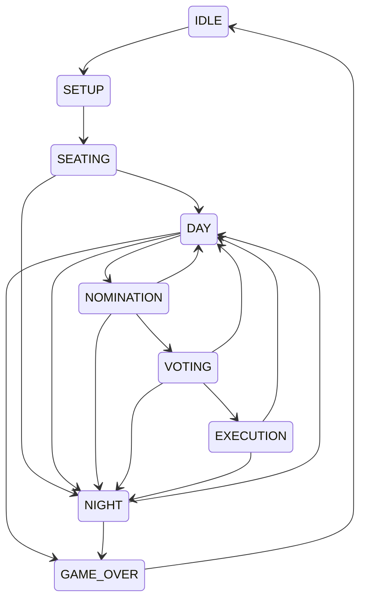

# Usage Guide

This guide covers everything players and server operators need to run Midnight Council games.

Midnight Council is a hidden-role social deduction mod for Minecraft Fabric. It provides the table tools a storyteller needs to run a session: a seating chart, nomination and voting flows, execution, day and night timers, and proximity voice chat. It does not assign or track character roles. Think of it as the board and the timer, not the rulebook for any specific game.

---

## Getting Started for Operators

### Prerequisites

- **Java 25** or later
- **Fabric Loader** 0.19.2 or later
- **Fabric API** 0.150.0+26.1.2 or later
- **Minecraft** 26.1.2
- The Midnight Council mod JAR installed on the server and on every client that wants voice chat and the in-game UI

Drop the mod JAR into the server's `mods/` folder and start the server once so it generates its config file. Players who want voice chat and the seating chart UI must also install the mod client-side.

### First steps

1. From the server console, grant yourself operator status: `/op <your-name>`.
2. Run `/midnight setup` to open the setup phase. Players can now join.
3. Have each player run `/midnight join`. They are auto-assigned the next open seat, numbered 1 through 15.
4. Optionally register one or more storytellers: `/midnight storyteller <player>`.
5. Run `/midnight start` to move into the seating phase.

A common point of confusion: `/midnight start` does **not** start play. It transitions from SETUP into SEATING, which is the layout and roster confirmation phase. The game proper begins when the operator transitions to DAY, which validates the player count and increments the day counter to 1.

---

## Command Reference

All commands live under the `/midnight` root.

> **Note on permissions**: In-game error messages refer to "storytellers," but the actual permission check is Minecraft operator (OP) status. Grant OP via `/op <player>` in the server console. A player registered as a "storyteller" via `/midnight storyteller` still needs OP to run operator commands.

| Command | Arguments | Permission | Phase | Description |
|---|---|---|---|---|
| `/midnight status` | none | Any player | Any | Shows current phase, alive/total players, day/night counts |
| `/midnight join` | none | Any player | SETUP | Auto-assigns next open seat (1-15), registers as player |
| `/midnight leave` | none | Any player | SETUP | Removes from roster |
| `/midnight storyteller` | `<player>` | Operator (OP) | SETUP | Registers target as storyteller (seat 0). Target must already have OP. |
| `/midnight setup` | none | Operator (OP) | IDLE → SETUP | Starts setup phase |
| `/midnight start` | none | Operator (OP) | SETUP → SEATING | Starts seating phase |
| `/midnight phase` | `<phase>` | Operator (OP) | Varies | Transitions to specified phase (tab-completes valid options) |
| `/midnight nominate` | `<nominator> <nominee>` | Operator (OP) | NOMINATION | Opens a nomination |
| `/midnight vote start` | `[player]` | Operator (OP) | VOTING | Starts vote on nominated player (or specified player) |
| `/midnight vote yes` | none | Any player | During vote | Casts YES vote |
| `/midnight vote no` | none | Any player | During vote | Casts NO vote |
| `/midnight execute` | `<player>` | Operator (OP) | EXECUTION | Kills target, marks their seat |
| `/midnight timer discussion` | none | Operator (OP) | Any | Starts discussion timer (180s default) |
| `/midnight timer nomination` | none | Operator (OP) | Any | Starts nomination timer (30s default) |
| `/midnight timer stop` | none | Operator (OP) | Any | Stops running timer |

The `/midnight phase` argument tab-completes only the phases reachable from the current one, so operators cannot accidentally make an illegal transition.

---

## Game Lifecycle

### Phase state diagram



### Valid transitions

| From | To |
|---|---|
| IDLE | SETUP |
| SETUP | SEATING |
| SEATING | DAY, NIGHT |
| DAY | NOMINATION, NIGHT, GAME_OVER |
| NOMINATION | VOTING, DAY, NIGHT |
| VOTING | EXECUTION, DAY, NIGHT |
| EXECUTION | DAY, NIGHT |
| NIGHT | DAY, GAME_OVER |
| GAME_OVER | IDLE |

### Phase descriptions

- **IDLE**: No game in progress. The session is empty and waiting for setup.
- **SETUP**: Roster building. Players join and leave, storytellers register.
- **SEATING**: Layout confirmation. Seats are locked in. Transitioning to DAY from here starts the actual game.
- **DAY**: Discussion and nominations. Players talk, the operator can run a discussion timer.
- **NOMINATION**: A nomination is open. The operator names a nominator and nominee.
- **VOTING**: Players cast YES or NO votes on the current nominee.
- **EXECUTION**: The operator resolves the vote by killing a player and marking their seat.
- **NIGHT**: Night phase. Night counter increments on entry.
- **GAME_OVER**: The session has ended. Transition back to IDLE resets state.

### Typical play loop

A full session usually follows this arc:

```text
setup → join → start → phase day → phase nomination → nominate
       → phase voting → vote → phase execution → execute
       → phase night → phase day (repeat)
       → phase game_over → phase idle
```

The loop from DAY through NIGHT repeats until the storyteller decides the game is over and transitions to GAME_OVER.

### Transition side effects

Several transitions carry automatic side effects that operators should know about:

- **SEATING → DAY** validates that 5 to 15 non-storyteller players are registered and increments the day count to 1. This is the moment the "game" actually starts.
- **Any → NIGHT** increments the night count.
- **Leaving VOTING** (transitioning to any non-VOTING phase) resets all current vote state.
- **→ DAY from NIGHT or EXECUTION** resets daily nominations, so nominators and nominees are free to participate again.
- **Vote threshold** is a simple majority: `(eligible_voters / 2) + 1`. Half-and-half ties fail.
- **Nomination rules**: one nomination per nominator per day, and one nomination per nominee per day.
- **→ IDLE** stops any running timer, clears vote state, resets daily nominations, and clears the roster.

---

## Client Features

### Seating Chart

Press **K** in game to open the seating chart overlay. It shows the full roster as a circular ring of players sorted by seat number.

Color coding:

- **Green**: alive player
- **Grey**: dead player
- **Red outline**: currently nominated
- **Magenta outline**: marked for execution

Storytellers appear at the center of the ring with a ★ marker.

### HUD Overlay

A compact status overlay appears automatically during in-game phases (DAY, NOMINATION, VOTING, EXECUTION, NIGHT) and hides during IDLE, SETUP, SEATING, and GAME_OVER. It shows the current phase name, day and night counts, alive and total player counts, and a timer indicator when a timer is running.

### Voice Chat

Voice chat is proximity-based and connects automatically when a player joins the server. Audio is encoded with the Opus codec, and the transport is secured with ECDH (X25519) key exchange plus AES-GCM encryption with replay protection.

**No push-to-talk or mute keybind exists.** Voice is always on while a client is connected. See [Limitations](#limitations).

---

## Voice Configuration

Voice settings live in `config/midnightcouncil.properties`, which the server auto-generates on first start.

| Key | Default | Description |
|---|---|---|
| `voice.port` | `24454` | UDP port for the voice server |
| `voice.distance` | `40.0` | Hearing radius in blocks |
| `voice.connectTokenSecret` | auto-generated UUID | HMAC secret for voice auth tokens |

For dedicated servers, UDP port **24454** must be open on the firewall or voice chat will silently fail to connect. The `voice.connectTokenSecret` is generated once and then persisted. Rotate it by deleting the line and restarting, which invalidates any prior tokens.

---

## Timer Configuration

Timer durations are read from the same `config/midnightcouncil.properties` file.

| Key | Default | Description |
|---|---|---|
| `discussionTimerSeconds` | `180` | Discussion timer duration in seconds |
| `nominationTimerSeconds` | `30` | Nomination timer duration in seconds |

Timers are server-authoritative. When they expire, the server dispatches a `TimerExpired` event. The operator still has to advance the phase manually.

---

## Limitations

Midnight Council is a management tool, not a full rules engine. Keep these limits in mind:

- **No role logic.** This mod manages seats, votes, timers, and voice. It does not assign, track, or resolve character abilities. The storyteller handles all role rules.
- **No push-to-talk or mute keybind.** Voice is always on while connected. Players who need to mute must do so at the OS level or disconnect.
- **No commands to kill or revive players**, put them to sleep or wake them, or claim specific seats manually. Seat assignment is automatic via `/midnight join`.
- **No auto-save.** Game state is held in memory. A server restart wipes the current session.
- **No in-game help command.** `/midnight help` does not exist. Refer to this guide instead.
- **Vote results do not auto-execute.** After a vote resolves, the operator must manually transition to EXECUTION and run `/midnight execute <player>`.
- **All players must install the client mod** for voice chat and the seating chart UI. Vanilla clients can connect but will not get voice or the overlay.

---

## Troubleshooting

**Voice not working?** The most common cause is the server firewall. Make sure UDP port 24454 is open on the server. Also confirm every player has the client mod installed.

**Config issues?** Stop the server, delete `config/midnightcouncil.properties`, and restart. Defaults are regenerated on boot.

**Java version errors?** The mod requires Java 25 or later. Check `java -version` on the server host and update if needed.

**Commands not working?** Confirm you have OP status. Run `/op <your-name>` from the server console. Operator status is what the mod actually checks, regardless of any storyteller registration.

**Phase transition rejected?** The phase you want may not be reachable from the current one. Run `/midnight phase` and press Tab to see the valid options. Transitions that look obvious (like SETUP → DAY) are intentionally blocked. You have to go through SEATING.
